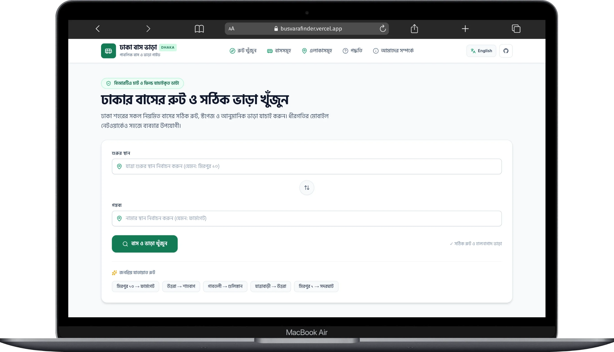

# Dhaka Bus Vara (ঢাকা বাস ভাড়া)

[](https://github.com/maruf-pfc/busvarafinder/actions)
[](LICENSE)
[](https://kit.svelte.dev)
[](https://www.typescriptlang.org)

**Dhaka Bus Vara** ([busvarafinder.vercel.app](https://busvarafinder.vercel.app)) is a production-quality, mobile-first, open-source transit web application designed for commuters in **Dhaka, Bangladesh** to search public bus routes, calculate exact ticket fares, view stop timelines, and explore bus and location directories in both English and Bengali (বাংলা).

- 🌐 **Live Website**: [https://busvarafinder.vercel.app](https://busvarafinder.vercel.app)

<p align="center">
  
</p>

---

## 🌟 Key Features

- **Instant Fare & Route Calculator**: Select or search origin and destination with fuzzy Bengali & English autocomplete.
- **Direct Bus Comparison**: See all buses serving your selected journey with verified fares, stop counts, and estimated duration.
- **Stop Timeline & Sequence**: Visual route timeline highlighting origin, destination, and intermediate stops.
- **Directional Routing**: Handles one-way and bidirectional routes correctly based on stop sequence.
- **Bus Directory (`/buses`)**: Browse, search, and filter verified Dhaka bus lines (Bahon, Victor Classic, Akash, Raida, Bihanga, Turag, Winner, Anabil, Shikor, Alif, Projapoti, Savar, Basumati, Thikana, etc.).
- **Location Directory (`/locations`)**: Explore Dhaka transit hubs and stops grouped by area (Mirpur, Uttara, Dhanmondi, Farmgate, Motijheel, Old Dhaka, Badda, Savar, etc.).
- **Data Provenance & Transparency**: Every transport record includes `source`, `verifiedAt`, and confidence level (`verified` | `community-reported`).
- **Bilingual Support (English & বাংলা)**: Instant locale toggle across all UI strings, aliases, and stop names.
- **Blazing Performance & Offline-Ready**: Fast sub-millisecond client-side routing on slow 2G/3G mobile networks.
- **Accessible & Responsive**: Fully keyboard navigable (ARIA combobox), WCAG 2.2 AA contrast, mobile-first design.

---

## 🛠️ Technology Stack

- **Framework**: [SvelteKit](https://kit.svelte.dev) (SSR + Static Prerendering)
- **Language**: [TypeScript](https://www.typescriptlang.org) (Strict typing)
- **Styling**: [Tailwind CSS v4](https://tailwindcss.com) (Dhaka transit tokens, high-contrast palette)
- **Icons**: [Lucide Icons](https://lucide.dev)
- **Validation**: [Zod](https://zod.dev)
- **Testing**: [Vitest](https://vitest.dev) (Unit & Data Integrity) & [Playwright](https://playwright.dev) (End-to-End)
- **Quality Gates**: ESLint, Prettier, svelte-check

---

## 🚀 Getting Started

### Prerequisites

- Node.js `v20+` or `v22+`
- npm or pnpm or bun

### Installation

```bash
# Clone repository
git clone https://github.com/maruf-pfc/busvarafinder.git
cd busvarafinder

# Install dependencies
npm install

# Copy environment example
cp .env.example .env

# Run development server
npm run dev
```

Visit [http://localhost:5173](http://localhost:5173) in your browser.

---

## 🧪 Testing & Verification

```bash
# Run unit & data integrity tests
npm run test:unit -- --run

# Run type checks
npm run check

# Run linting
npm run lint

# Run Playwright End-to-End tests
npm run test:e2e

# Build production bundle
npm run build
```

---

## 📁 Project Architecture

```text
src/
├── lib/
│   ├── components/
│   │   ├── bus/             # Bus cards, fare displays, timelines, badges
│   │   ├── layout/          # Header, Footer, responsive navigation
│   │   └── search/          # Accessible LocationCombobox, JourneySearch
│   ├── data/
│   │   ├── buses.json       # Verified bus operators and provenance
│   │   ├── locations.json   # 40+ Dhaka stops with aliases & coords
│   │   ├── routes.json      # Stop order, directionality, and routes
│   │   ├── fares.json       # Verified segment fares
│   │   └── data-integrity.test.ts # Data relational test suite
│   ├── domain/              # Zod schemas & TypeScript models
│   ├── i18n/                # Bilingual dictionary & locale store
│   ├── repositories/        # In-memory indexed transport repository
│   └── services/            # Route finder & fare calculation engine
└── routes/
    ├── +page.svelte         # Instant fare calculator homepage
    ├── route/[from]/to/[to] # Shareable route result page
    ├── buses/               # Bus directory & search
    ├── bus/[slug]           # Bus detail page with complete stop sequence
    ├── locations/           # Location directory
    ├── location/[slug]      # Location hub page with passing buses
    ├── methodology/         # Transparent fare calculation rules
    ├── about/               # Mission & open-source principles
    ├── contribute/          # Contribution guidelines
    └── sitemap.xml          # Dynamic SEO sitemap
```

---

## 🤝 Contributing

We welcome community contributions! Commuters can help update changed fares, add missing stops, or contribute new buses.

Please read our [Contributing Guide](CONTRIBUTING.md) and explore the documentation:

- [Adding a Bus Guide](docs/adding-a-bus.md)
- [Updating Fares Guide](docs/updating-fares.md)
- [Data Verification Guide](docs/data-verification.md)
- [Architecture Design](docs/architecture.md)

---

## 📄 License

This project is open-source and licensed under the [MIT License](LICENSE).
