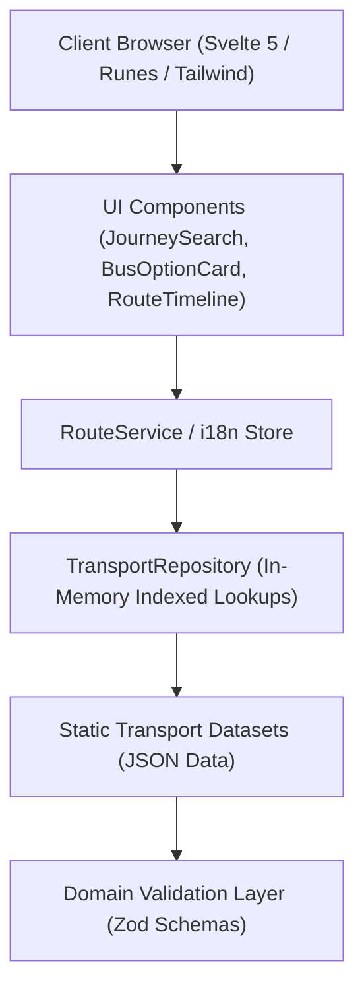

# Dhaka Bus Vara — Technical Architecture

This document provides a technical overview of the system architecture, domain design, route-finding algorithms, and data structures powering **Dhaka Bus Vara**.

---

## 1. Architecture Overview

Dhaka Bus Vara follows a layered, modular architecture with strict separation of concerns:

### Key Principles:

1. **Zero Runtime Database Overhead**: All Dhaka transit datasets (`locations.json`, `buses.json`, `routes.json`, `fares.json`) are validated compile-time/start-time and indexed in-memory.
2. **Sub-Millisecond Query Response**: Lookups by ID, slug, aliases, and directional stop pairs run in memory in <1ms without network waterfalls.
3. **Bilingual Reactive State**: Svelte stores manage locale changes seamlessly without altering page URLs or disrupting SEO indexing.

---

## 2. Transport Domain Model

All entities are strongly typed in TypeScript and validated with Zod in `src/lib/domain/`:

- **`Location`**: Unique transit stop, intersection, or terminal with Bengali and English names, searchable aliases, and area tags.
- **`Bus`**: Bus service entity with operator classification (`regular`, `seating_service`, `ac`, `brtc`), color code, operating hours, and provenance.
- **`BusRoute`**: Ordered sequence of `RouteStop` entries from origin to destination, directionality flag (`bidirectional: true/false`), and distance metrics.
- **`FareSegment`**: Verified pairwise segment fares with minimum and maximum BDT values and basis types (`brta_rate`, `operator_fixed`, `community_reported`).
- **`SourceMetadata`**: Attribution record with `name`, `verifiedAt`, and `confidence` (`verified`, `community-reported`, `unverified`).

---

## 3. Route-Finding & Direction Engine

The `RouteService` handles direct transit discovery:

1. **Stop Indexing**: For each registered route, it locates the origin stop index ($i_{from}$) and destination stop index ($i_{to}$).
2. **Directional Evaluation**:
   - **Forward Direction**: If $i_{from} < i_{to}$, the bus travels directly in the forward direction.
   - **Reverse Direction**: If $i_{from} > i_{to}$ and `bidirectional === true`, the bus travels directly in the reverse return direction.
   - **One-Way Routes**: If `bidirectional === false`, reverse routes are strictly excluded.
3. **Fare Resolution**:
   - If an explicit verified fare segment exists for $(from, to)$, the exact/verified fare is returned.
   - Otherwise, the engine uses the BRTA distance tier formula based on stop sequence distance:
     $$\text{Fare}_{\min} = \max(\text{BaseFare}, \text{BaseFare} + (N_{\text{stops}} - 1) \times \text{Rate}_{\text{stop}})$$

---

## 4. SEO & Prerendering

- **Static Generation & SSR**: Pre-renders major hub pages and directories for optimal indexing.
- **Dynamic Sitemap**: Automatically registers all `/bus/[slug]`, `/location/[slug]`, and verified route paths in `sitemap.xml`.
- **JSON-LD Structured Data**: Emits schema.org `BusService`, `BusStation`, and `Trip` structured data.
